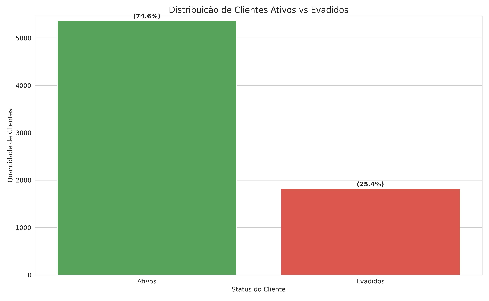
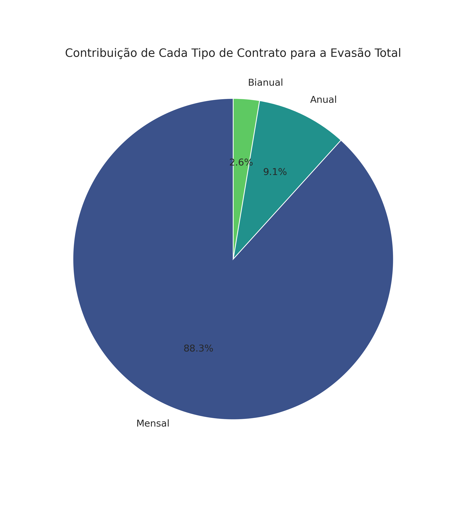

# Análise de Evasão de Clientes - **Telecom X**

## Descrição do Projeto
&nbsp;&nbsp;&nbsp;&nbsp;Este projeto tem como objetivo **analisar os fatores que influenciam a evasão de clientes (churn)** na **Telecom X**, identificando padrões comportamentais e variáveis-chave associadas ao cancelamento de serviços.  

&nbsp;&nbsp;&nbsp;&nbsp;A partir de uma **análise exploratória de dados (EDA)**, foram identificadas **tendências, correlações e perfis de risco**, oferecendo **insights estratégicos** para aumentar a retenção e reduzir a taxa de churn.

---
### 🚀 Projetos em Destaque
- [Criando um modelo de Machine learning para prever Churn](https://github.com/KaikeGM/Challenge-Telecom-X-Data-Science-Parte-2)
---

## 🧰 Tecnologias
- Python (pandas, numpy, matplotlib, seaborn)
- Jupyter Notebook

---

## O que é Churn?
&nbsp;&nbsp;&nbsp;&nbsp;O termo **churn** (ou **churn rate**) refere-se à **taxa de evasão de clientes**, ou seja, **a proporção de clientes que deixam de utilizar os serviços de uma empresa em determinado período**.  

&nbsp;&nbsp;&nbsp;&nbsp;Em empresas de telecomunicações, o churn é um **indicador crítico de desempenho**, pois revela o nível de **satisfação, fidelização e competitividade** da base de clientes.  
&nbsp;&nbsp;&nbsp;&nbsp;Um alto churn pode significar **problemas na qualidade do serviço, no suporte, nos preços ou nos planos oferecidos**, impactando diretamente a **receita recorrente** da empresa.

---

## Contexto de Negócio
&nbsp;&nbsp;&nbsp;&nbsp;A **Telecom X** enfrenta uma taxa de evasão de **25,4%**, dentro do intervalo típico do setor de telecomunicações (15%–30%).  
&nbsp;&nbsp;&nbsp;&nbsp;O desafio é compreender:

1. Quais características dos clientes estão mais associadas à evasão?  
2. Quais serviços ou planos têm maior impacto na retenção?  
3. Como fatores financeiros (mensalidade e gastos totais) se relacionam com o churn?

---

## Principais Análises e Insights

### 1. Distribuição de Churn
- **25,4%** dos clientes cancelaram o serviço.  
- **74,6%** permanecem ativos.

   *A taxa está dentro do esperado, mas ainda representa uma perda significativa de receita.*

---

### 2. Fatores Críticos de Evasão

#### a) Tipo de Contrato
| Tipo de Contrato | Taxa de Evasão |
|------------------|----------------|
| Mensal | **88,3%** |
| Anual | 9,1% |
| Bianual | 2,6% |

**Insight:**  
&nbsp;&nbsp;&nbsp;&nbsp;Clientes com contratos de longo prazo têm **maior comprometimento e menor propensão ao cancelamento**.  
 *Contratos mensais concentram a maioria das perdas.*

---

#### b) Método de Pagamento
| Método | Evasão |
|---------|--------|
| Cheque eletrônico | **43,2%** |
| Cartão de crédito (automático) | **14,8%** |
| Transferência bancária (automático) | **16.2%** |

**Insight:**  
&nbsp;&nbsp;&nbsp;&nbsp;Pagamentos automáticos estão fortemente associados à **retenção de clientes**, reduzindo a evasão em mais de **74%**.

---

#### c) Serviços Adicionais
| Serviço | Evasão Sem Serviço | Evasão Com Serviço |
|----------|--------------------|--------------------|
| Segurança Online | 40,0% | **14,2%** |
| Suporte Técnico | 39,8% | **14,7%** |

**Insight:**  
&nbsp;&nbsp;&nbsp;&nbsp;A adesão a **serviços adicionais** (como segurança online e suporte técnico) é um dos **principais fatores de proteção** contra churn.

---

### 3. Análise Financeira

#### a) Gastos Mensais
| Grupo | Média (R$) |
|--------|-------------|
| Clientes que evadem | **74,93** |
| Clientes ativos | 61,57 |

**Insight:**  
&nbsp;&nbsp;&nbsp;&nbsp;Clientes com **mensalidades mais altas** têm **21,7% mais chance** de cancelar o serviço, possivelmente devido à **sensibilidade ao preço**.

---

#### b) Gastos Totais
| Grupo | Média (R$) |
|--------|-------------|
| Clientes que evadem | **1.569,06** |
| Clientes ativos | 2.554,50 |

**Insight:**  
&nbsp;&nbsp;&nbsp;&nbsp;Clientes com **histórico de maior gasto total** são **mais fiéis**, indicando **relações de longo prazo e maior valor para a empresa**.

---

### 4. Correlações com Churn
| Variável | Correlação com Churn | Interpretação |
|-----------|----------------------|----------------|
| Pagamento por cheque eletrônico | **+29%** | Aumenta o risco de evasão |
| Gastos mensais elevados | **+19%** | Aumenta o risco |
| Contrato bianual | **−29%** | Reduz o risco |
| Serviços de segurança/suporte | **−16%** | Reduz o risco |

---

##  Conclusões Gerais
1. **Contratos mensais** representam o maior fator de risco para churn.  
2. **Pagamentos não automáticos** (como cheque eletrônico) **dobram o risco** de cancelamento.  
3. **Serviços adicionais** (segurança e suporte técnico) **aumentam a fidelização**.  
4. **Clientes com mensalidades mais altas** e **baixo tempo de contrato** são o grupo mais vulnerável à evasão.

---

##  Recomendações Estratégicas

### 1. Converter contratos mensais em anuais
- Descontos de **10–15% no primeiro ano**.  
- Benefícios extras (ex: **3 meses de streaming grátis**).  
- Programas de **upgrade automático** após 6 meses.

### 2. Incentivar pagamentos automáticos
- **Desconto de 5%** para adesão ao débito automático.  
- Campanha de conscientização: “Automático é mais prático”.  
- **Suporte prioritário** para clientes automáticos.

### 3. Promover pacotes de serviços adicionais
- Criar o **pacote “Segurança Total”** (OnlineSecurity + TechSupport) por R$15/mês.  
- **Teste gratuito de 30 dias** para novos assinantes.  
- Bonificação de fidelidade para quem mantém o pacote por 12 meses.

### 4. Programa de fidelidade
- Recompensar clientes com **mensalidade acima de R$80**.  
- Benefícios progressivos: **descontos, atendimento VIP, upgrades de plano**.  
- Objetivo: **reduzir churn em 30% nos próximos 12 meses.**

---

##  Respostas às Perguntas de Negócio

### 1️ Quais características dos clientes estão mais associadas à evasão?
- **Contratos mensais**,  
- **Pagamentos via cheque eletrônico**,  
- **Ausência de serviços adicionais** (como segurança ou suporte técnico),  
- **Mensalidades altas com baixo engajamento**.  

 *Esses fatores indicam baixa fidelização e sensibilidade a preço.*

---

### 2️ Quais serviços ou planos têm maior impacto na retenção?
- **Contratos de longo prazo (anual/bianual)** e  
- **Serviços adicionais** (segurança online e suporte técnico)  
têm o **maior impacto positivo** na retenção.  

 *Esses clientes apresentam taxas de evasão até 70% menores.*

---

### 3️ Como fatores financeiros se relacionam com o churn?
- **Mensalidades mais altas** estão associadas a **maior probabilidade de evasão**, sugerindo que o **custo** é um ponto sensível.  
- **Gastos totais mais altos** refletem **clientes antigos e fiéis**, com **menor chance de cancelar**.  

 *Ou seja, o valor mensal é um risco, mas o histórico de gasto total é um sinal de lealdade.*

---
